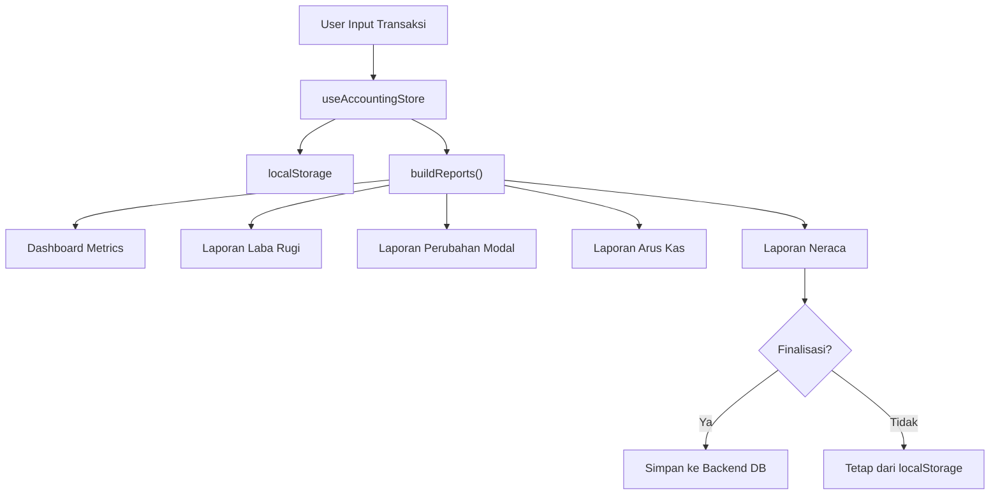

# 📋 Penjelasan Lengkap Proyek: PRODEV — Housing Finance System

## 1. Gambaran Umum

Proyek ini adalah **Sistem Informasi Pengelolaan Keuangan Developer Perumahan** (disingkat **PRODEV**). Ini adalah aplikasi web **dashboard keuangan** yang dirancang khusus untuk perusahaan developer perumahan, di mana semua transaksi keuangan dicatat menggunakan prinsip **akuntansi double-entry** (debit/kredit).

Aplikasi ini memiliki **dua arsitektur yang berjalan bersamaan**:
1. **Client-side engine** — Mesin akuntansi lokal yang berjalan di browser (menggunakan `localStorage`)
2. **Server-side API** — Terhubung ke backend Express.js di `localhost:5000` untuk fitur enterprise (login, approval, finalisasi laporan)

---

## 2. Tech Stack

| Lapisan | Teknologi |
|---------|-----------|
| **Framework** | Next.js 16 (App Router) |
| **Bahasa** | TypeScript 5 |
| **UI Library** | React 19 |
| **Styling** | Tailwind CSS v4 (via PostCSS) |
| **Icons** | Lucide React |
| **State Management** | React Context API + Custom Hooks + localStorage |
| **Backend** | Express.js (repo terpisah di `d:\backend-developer-perumahan`) |
| **Autentikasi** | JWT (Bearer Token) |

---

## 3. Struktur Folder

```
src/
├── app/                          # Next.js App Router (halaman-halaman)
│   ├── layout.tsx                # Root layout — provider wrapper
│   ├── page.tsx                  # Dashboard utama
│   ├── globals.css               # CSS global + Tailwind
│   ├── (auth)/login/             # Halaman login
│   ├── (dashboard)/              # Route group untuk halaman terproteksi
│   │   ├── approval/             # Halaman approval transaksi
│   │   └── users/                # Manajemen user (CRUD)
│   ├── transaksi/                # Manajemen transaksi (jurnal)
│   ├── master-akun/              # Master Chart of Accounts
│   ├── laporan/                  # Laporan keuangan
│   │   ├── neraca/               # Laporan Neraca (Balance Sheet)
│   │   ├── laba-rugi/            # Laporan Laba Rugi (Income Statement)
│   │   ├── arus-kas/             # Laporan Arus Kas (Cash Flow)
│   │   └── perubahan-modal/      # Laporan Perubahan Modal (Equity Change)
│   └── api/                      # Next.js API routes (proxy ke backend)
│       ├── auth/                 # Proxy autentikasi
│       └── users/                # Proxy user
├── components/                   # Komponen UI reusable
│   ├── finance-shell.tsx         # Layout utama (sidebar + topbar + content)
│   ├── finance-ui.tsx            # Komponen UI dasar (Card, PageHeader, Btn)
│   ├── Sidebar.tsx               # Sidebar navigasi (legacy)
│   ├── Pagination.tsx            # Komponen pagination
│   ├── PageTransition.tsx        # Animasi transisi halaman
│   ├── SessionWarningModal.tsx   # Modal peringatan sesi idle
│   ├── SessionWarningToast.tsx   # Toast peringatan sesi
│   └── ToastContainer.tsx        # Container notifikasi toast
├── contexts/                     # React Context Providers
│   ├── AuthContext.tsx           # Autentikasi + manajemen sesi
│   ├── ToastContext.tsx          # Notifikasi toast
│   ├── ConfirmDialogContext.tsx  # Dialog konfirmasi
│   ├── ActivityLogContext.tsx    # Log aktivitas
│   └── MobileMenuContext.tsx     # Toggle menu mobile
├── hooks/                        # Custom React Hooks
│   ├── useAccountingStore.ts     # ⭐ Store utama (accounts + transactions + reports)
│   ├── useApi.ts                 # Hook base untuk API calls
│   ├── useApiEndpoints.ts        # Hook domain-specific API
│   ├── useFetch.ts               # Generic data fetching
│   └── index.ts                  # Re-exports
├── lib/                          # Logic bisnis inti
│   ├── accounting.ts             # ⭐ Mesin akuntansi (tipe data, buildReports)
│   └── verify-reports.ts         # Verifikasi laporan
├── services/
│   └── api-client.ts             # Class-based API client (legacy)
├── types/
│   └── financial-system.ts       # Definisi TypeScript untuk entity backend
└── utils/
    └── financial-constants.ts    # Konstanta, endpoint API, format helper
```

---

## 4. Fitur-Fitur Utama

### 4.1 🔐 Autentikasi & Manajemen Sesi
**File:** [AuthContext.tsx](file:///d:/Pengelolaan-Perusahaan/pengelolaan-perusahaan/src/contexts/AuthContext.tsx)

- Login via API backend (`POST /api/auth/login`)
- JWT token disimpan di `localStorage`
- **Idle Timeout 15 menit** — jika user tidak aktif, akan auto-logout
- **Absolute Timeout 8 jam** — batas maksimal sesi login
- **Peringatan 1 menit sebelum idle logout** — muncul modal untuk memperpanjang sesi
- Deteksi aktivitas user (mouse click, keyboard, touch, scroll) dengan debouncing
- Mendukung 3 format respons login dari backend (fleksibel)

### 4.2 📊 Dashboard Keuangan
**File:** [page.tsx](file:///d:/Pengelolaan-Perusahaan/pengelolaan-perusahaan/src/app/page.tsx)

Menampilkan ringkasan keuangan:
- **4 Metric Cards**: Total Pendapatan, Total Beban, Laba Bersih, Total Aset
- **Transaksi Terakhir**: 5 transaksi terbaru
- **Saldo Kas & Bank**: Saldo semua akun kas/bank dengan total

### 4.3 📝 Manajemen Transaksi (Jurnal)
**File:** [transaksi/page.tsx](file:///d:/Pengelolaan-Perusahaan/pengelolaan-perusahaan/src/app/transaksi/page.tsx)

- Form input transaksi double-entry (pilih akun debit & kredit)
- Validasi: akun debit ≠ akun kredit, nominal > 0
- Tabel daftar semua transaksi (tanggal, keterangan, debit, kredit, nominal)
- Hapus transaksi
- **Setiap perubahan transaksi otomatis memperbarui SEMUA laporan keuangan**

### 4.4 📂 Master Akun (Chart of Accounts)
**File:** [master-akun/page.tsx](file:///d:/Pengelolaan-Perusahaan/pengelolaan-perusahaan/src/app/master-akun/page.tsx)

- Bagan akun hierarkis (parent-child) dengan 5 tipe:
  - **Aset** (kode 1xx): Kas, Bank, Piutang, Persediaan, Peralatan
  - **Kewajiban** (kode 2xx): Utang Kontraktor, Utang Usaha, Utang Bank
  - **Modal** (kode 3xx): Modal Pemilik, Prive
  - **Pendapatan** (kode 4xx): Penjualan Rumah, Booking Fee, Admin KPR
  - **Beban** (kode 5xx): Pembangunan, Material, Upah, Marketing, Gaji, dll
- Kode akun auto-generate berdasarkan tipe dan parent
- CRUD akun (tambah, edit, hapus termasuk child)

### 4.5 📈 Laporan Keuangan (4 Laporan)

#### A. Laporan Laba Rugi (Income Statement)
- Pendapatan vs Beban → Laba Bersih
- Tampilan hierarkis per akun

#### B. Laporan Perubahan Modal (Equity Change)
- Modal Awal + Laba Bersih − Prive = Ekuitas Akhir

#### C. Laporan Arus Kas (Cash Flow)
- **Operasional**: Kas dari pelanggan, kas untuk beban operasional
- **Investasi**: Kas dari pembelian/penjualan aset tetap
- **Pendanaan**: Kas dari modal dan pinjaman
- Klasifikasi otomatis berdasarkan tipe akun counterpart

#### D. Laporan Neraca (Balance Sheet)
**File:** [neraca/page.tsx](file:///d:/Pengelolaan-Perusahaan/pengelolaan-perusahaan/src/app/laporan/neraca/page.tsx)
- **Aset = Kewajiban + Ekuitas** (rumus dasar akuntansi)
- Indikator balance: SEIMBANG ✓ / TIDAK SEIMBANG ✗
- Fitur **Finalisasi Laporan** — mengunci periode dan menyimpan ke database
- Setelah finalisasi: data dari database, bukan dari localStorage

### 4.6 ✅ Halaman Approval
- Untuk role **Manager** dan **Owner**
- Approve/reject transaksi yang berstatus PENDING

### 4.7 👥 Manajemen User
- Khusus role **Admin**
- CRUD user (tambah, edit, hapus)

---

## 5. Mesin Akuntansi (Core Engine)

> [!IMPORTANT]
> Ini adalah jantung dari aplikasi — file [accounting.ts](file:///d:/Pengelolaan-Perusahaan/pengelolaan-perusahaan/src/lib/accounting.ts) (376 baris)

### Bagaimana `buildReports()` Bekerja

Fungsi ini dipanggil **sekali setiap kali data berubah** dan menghasilkan semua angka yang dibutuhkan UI:

```
Input: accounts[] + transactions[]
  ↓
Step 1: Hitung saldo leaf-level (normal-side aware)
        - Aset & Beban → debit (+), kredit (−)
        - Kewajiban, Modal, Pendapatan → kredit (+), debit (−)
  ↓
Step 2: Roll-up saldo parent = sum of children
  ↓
Step 3: Cash Flow Report — klasifikasi berdasarkan tipe akun counterpart
  ↓
Step 4: Build hierarchical report nodes (pohon akun)
  ↓
Step 5: Income Statement (Pendapatan − Beban = Laba)
  ↓
Step 6: Equity Change (Modal + Laba − Prive)
  ↓
Step 7: Balance Sheet (Aset = Kewajiban + Ekuitas)
  ↓
Output: Reports { balances, cashFlowReport, incomeStatement, equityChange, balanceSheet }
```

### Alur Data



---

## 6. Arsitektur State Management

### Tumpukan Provider (Root Layout)
```
ToastProvider → AuthProvider → ConfirmDialogProvider → FinanceShell → {children}
```

### Sumber Data (2 Layer)

| Layer | Sumber | Dipakai Untuk |
|-------|--------|---------------|
| **Client-side** | `useAccountingStore` → `localStorage` | Akun, transaksi, semua kalkulasi laporan |
| **Server-side** | `useApiEndpoints` → Express.js API | Login, finalisasi, approval, user management |

### Hook Utama: [useAccountingStore](file:///d:/Pengelolaan-Perusahaan/pengelolaan-perusahaan/src/hooks/useAccountingStore.ts)
- Load data dari `localStorage` saat mount (atau gunakan data default)
- CRUD accounts & transactions
- `buildReports()` di-recalculate via `useMemo` setiap data berubah
- Fungsi `resetData()` untuk kembali ke data default

---

## 7. Role-Based Access Control

| Role | Dashboard | Transaksi | Master Akun | Laporan | Approval | Users |
|------|-----------|-----------|-------------|---------|----------|-------|
| **Admin** | ✅ | ✅ | ✅ | ✅ (semua) | ❌ | ✅ |
| **Marketing** | ✅ | ❌ | ❌ | ❌ | ❌ | ❌ |
| **Manager** | ✅ | ✅ | ✅ | ✅ (semua) | ✅ | ❌ |
| **Owner** | ✅ | ✅ | ✅ | ✅ (semua) | ✅ | ❌ |

Menu sidebar difilter secara dinamis berdasarkan role user di [finance-shell.tsx](file:///d:/Pengelolaan-Perusahaan/pengelolaan-perusahaan/src/components/finance-shell.tsx#L52-L68).

---

## 8. Desain UI/UX

### Layout
- **Sidebar gelap** (bg-slate-900) di kiri — navigasi utama
- **Topbar putih** — branding, info user, tombol logout
- **Content area** — scroll independen
- **Responsif** — sidebar menjadi drawer di mobile

### Design System (Komponen Reusable)
File: [finance-ui.tsx](file:///d:/Pengelolaan-Perusahaan/pengelolaan-perusahaan/src/components/finance-ui.tsx)

| Komponen | Fungsi |
|----------|--------|
| `Card` | Container dengan rounded-2xl, shadow, border |
| `PageHeader` | Header halaman dengan ikon, judul, deskripsi, tombol aksi |
| `Btn` | Tombol dengan 3 varian: primary (indigo), secondary (slate), danger (rose) |

### Branding
- Nama: **PRODEV** (PRO = indigo-400, DEV = putih)
- Subtitle: "Housing System v2.0"
- Footer sidebar: "FINANCE SYSTEM"

---

## 9. Data Default (Sample Data)

Aplikasi sudah dilengkapi **29 akun default** dan **6 transaksi sample** yang relevan dengan bisnis developer perumahan:

### Contoh Transaksi Default:
| Tanggal | Deskripsi | Debit | Kredit | Nominal |
|---------|-----------|-------|--------|---------|
| 2 Jan 2026 | Setoran modal awal proyek | Bank BCA | Modal Pemilik | Rp5.000.000.000 |
| 10 Jan 2026 | Pembelian lahan tahap pertama | Persediaan Tanah | Bank BCA | Rp2.000.000.000 |
| 5 Feb 2026 | Booking fee Blok A-01 | Kas Besar | Pendapatan Booking Fee | Rp5.000.000 |
| 20 Feb 2026 | Bayar kontraktor pondasi | Beban Pembangunan | Bank BCA | Rp150.000.000 |
| 1 Mar 2026 | Jual rumah Blok A-01 (KPR) | Piutang KPR | Pendapatan Penjualan | Rp450.000.000 |
| 15 Mar 2026 | Iklan digital | Beban Marketing | Kas Besar | Rp2.500.000 |

---

## 10. Koneksi ke Backend

### API Endpoints yang Digunakan:
- **Auth**: Login, Logout, Verify token
- **Chart of Accounts**: CRUD + hierarki + filter by type
- **Transactions**: CRUD + approve/reject
- **Dashboard**: Stats, recent transactions, summary
- **Reports**: Balance sheet, income statement, cash flow, finalize
- **Users**: CRUD

### Environment Variables
File: [.env.local](file:///d:/Pengelolaan-Perusahaan/pengelolaan-perusahaan/.env.local)
```
NEXT_PUBLIC_API_URL=http://localhost:5000
NEXT_PUBLIC_APP_NAME=Sistem Pengelolaan Keuangan
NEXT_PUBLIC_APP_VERSION=1.0.0
NEXT_PUBLIC_ENABLE_BATCH_PROCESSING=false
NEXT_PUBLIC_ENABLE_ADVANCED_REPORTS=false
NEXT_PUBLIC_ENABLE_RBAC=false
```

> [!NOTE]
> Ada 3 feature flag yang masih `false`: batch processing, advanced reports, dan RBAC. Ini menunjukkan fitur-fitur tersebut masih dalam tahap pengembangan.

---

## 11. Kesimpulan

Proyek **PRODEV** adalah sistem keuangan developer perumahan yang cukup lengkap dengan:

- ✅ **Akuntansi double-entry** penuh (debit/kredit)
- ✅ **4 laporan keuangan** standar (Laba Rugi, Perubahan Modal, Arus Kas, Neraca)
- ✅ **Mesin kalkulasi otomatis** — setiap transaksi langsung memperbarui semua laporan
- ✅ **Role-based access control** (4 role)
- ✅ **Session management** canggih (idle + absolute timeout)
- ✅ **Finalisasi laporan** dengan penguncian periode
- ✅ **UI modern** dengan Tailwind CSS, animasi, dan responsif
- ✅ **Data default** yang relevan dengan bisnis perumahan

> [!TIP]
> Arsitektur hybrid (localStorage + backend API) memungkinkan aplikasi berjalan secara offline untuk kalkulasi, sekaligus menyimpan data penting ke server untuk audit dan finalisasi.
