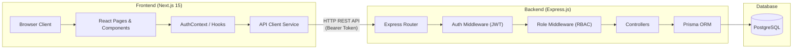
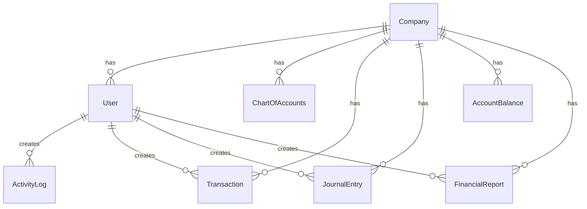
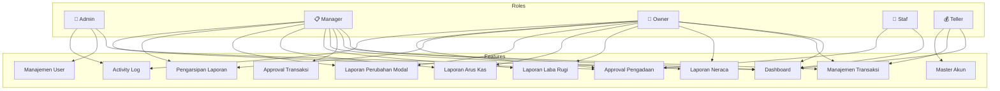
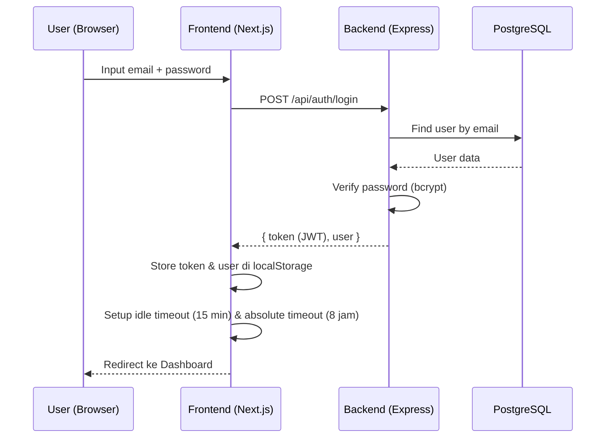
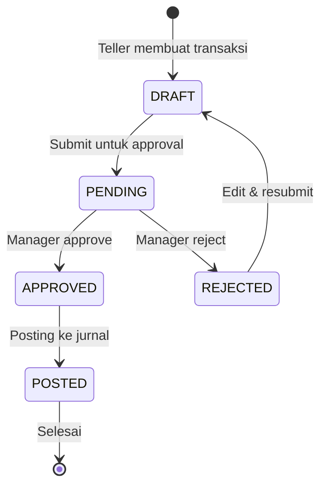
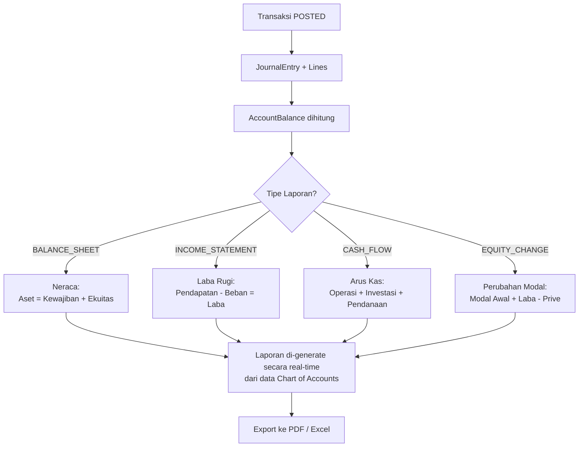

# 📊 Full System Overview — Pengelolaan Perusahaan (Company Financial Management)

Sistem ini adalah **aplikasi manajemen keuangan perusahaan perumahan** (housing developer) yang terdiri dari **2 proyek terpisah**: Backend API dan Frontend Web App.

---

## 🏗️ Arsitektur Tingkat Tinggi



| Layer | Teknologi | Lokasi |
|-------|-----------|--------|
| **Frontend** | Next.js 15, React 19, TypeScript, TailwindCSS | `d:\Pengelolaan-Perusahaan\pengelolaan-perusahaan` |
| **Backend** | Express.js, TypeScript, Prisma ORM | `d:\backend-developer-perumahan` |
| **Database** | PostgreSQL | Koneksi via `DATABASE_URL` di `.env` |
| **Auth** | JWT (JSON Web Token) | Backend generates, Frontend stores di localStorage |

---

## 📦 Database Schema (10 Model)

Semua model didefinisikan di [schema.prisma](file:///d:/backend-developer-perumahan/prisma/schema.prisma).

### Company & User Management



| Model | Deskripsi | Key Fields |
|-------|-----------|------------|
| **Company** | Data perusahaan (multi-company support) | `companyName`, `companyCode`, `fiscalYearStart` |
| **User** | Pengguna sistem | `email`, `password`, `role` (Admin/Manager/Owner/Staf/Teller), `companyId` |
| **ActivityLog** | Log aktivitas user | `userId`, `action`, `details` |

### Accounting System

| Model | Deskripsi | Key Fields |
|-------|-----------|------------|
| **ChartOfAccounts** | Daftar akun (hierarchical tree) | `accountCode`, `accountName`, `accountType` (ASSET/LIABILITY/EQUITY/REVENUE/EXPENSE), `parentId`, `level`, `isCashFlow` |
| **Transaction** | Transaksi keuangan | `transactionType` (PENDAPATAN/PENGELUARAN/TRANSFER/ADJUSTMENT), `debitAccountId`, `creditAccountId`, `amount`, `status` (DRAFT→PENDING→APPROVED/REJECTED→POSTED) |
| **JournalEntry** | Jurnal umum (double-entry bookkeeping) | `journalNo`, `transactionId`, `isPosted` |
| **JournalEntryLine** | Baris detail jurnal | `accountId`, `debit`, `credit` |
| **AccountBalance** | Saldo akun per periode | `periodDate`, `periodType` (MONTHLY/QUARTERLY/YEARLY), `openingBalance`, `closingBalance` |

### Financial Reports

| Model | Deskripsi | Key Fields |
|-------|-----------|------------|
| **FinancialReport** | Laporan keuangan | `reportType` (BALANCE_SHEET/INCOME_STATEMENT/CASH_FLOW), `status` (DRAFT/FINALIZED/ARCHIVED) |
| **BalanceSheetItem** | Item neraca (hierarchical) | `accountCode`, `accountName`, `balance`, `level`, `isParent` |
| **IncomeStatementItem** | Item laba rugi (hierarchical) | `accountCode`, `accountName`, `balance`, `level`, `isParent` |

---

## 🔙 Backend API — Struktur

### Entry Point

[index.ts](file:///d:/backend-developer-perumahan/src/index.ts) — Express server di port 5000

### API Routes

| Route Prefix | File | Deskripsi |
|-------------|------|-----------|
| `/api/auth` | [auth.ts](file:///d:/backend-developer-perumahan/src/routes/auth.ts) | Login, register, verifikasi token |
| `/api/users` | [users.ts](file:///d:/backend-developer-perumahan/src/routes/users.ts) | CRUD user (Admin only) |
| `/api/activity-logs` | [activityLog.ts](file:///d:/backend-developer-perumahan/src/routes/activityLog.ts) | Log aktivitas (Admin/Owner) |
| `/api/chart-of-accounts` | [chartOfAccounts.ts](file:///d:/backend-developer-perumahan/src/routes/chartOfAccounts.ts) | CRUD master akun |
| `/api/transactions` | [transactions.ts](file:///d:/backend-developer-perumahan/src/routes/transactions.ts) | CRUD transaksi + approval workflow |
| `/api/dashboard` | [dashboard.ts](file:///d:/backend-developer-perumahan/src/routes/dashboard.ts) | Dashboard stats + laporan keuangan |

### Controllers (Business Logic)

| Controller | File | Tanggung Jawab |
|-----------|------|----------------|
| **Auth** | [authController.ts](file:///d:/backend-developer-perumahan/src/controllers/authController.ts) | Login, register, JWT generation |
| **User** | [userController.ts](file:///d:/backend-developer-perumahan/src/controllers/userController.ts) | Manajemen user (CRUD, activate/deactivate) |
| **Activity Log** | [activityLogController.ts](file:///d:/backend-developer-perumahan/src/controllers/activityLogController.ts) | Query & filter log aktivitas |
| **Chart of Accounts** | [chartOfAccountsController.ts](file:///d:/backend-developer-perumahan/src/controllers/chartOfAccountsController.ts) | CRUD master akun hierarkis |
| **Transaction** | [transactionController.ts](file:///d:/backend-developer-perumahan/src/controllers/transactionController.ts) | Transaksi: create, approve, reject, post, journal creation |
| **Dashboard** | [dashboardController.ts](file:///d:/backend-developer-perumahan/src/controllers/dashboardController.ts) | Statistik dashboard |
| **Financial Report** | [financialReportController.ts](file:///d:/backend-developer-perumahan/src/controllers/financialReportController.ts) | Generate neraca, laba rugi, arus kas (26KB — terbesar) |

### Middleware

| Middleware | File | Fungsi |
|-----------|------|--------|
| **Auth** | [auth.ts](file:///d:/backend-developer-perumahan/src/middleware/auth.ts) | Validasi JWT token, check `isActive` status di DB |
| **Role** | [role.ts](file:///d:/backend-developer-perumahan/src/middleware/role.ts) | RBAC — membatasi akses berdasarkan role user |

---

## 🖥️ Frontend — Struktur Halaman

### App Router (Next.js 15)

```
src/app/
├── (auth)/login/              → Halaman login
├── (dashboard)/
│   ├── activity-log/          → Log aktivitas (Admin, Owner)
│   ├── approval/              → Halaman approval pengadaan (Staf, Manager, Owner)
│   └── users/                 → Manajemen user (Admin only)
│       ├── page.tsx           → List users
│       ├── add/               → Tambah user
│       └── [id]/edit/         → Edit user
├── transaksi/
│   ├── page.tsx               → Manajemen transaksi (Teller, Manager, Owner)
│   └── approval/              → Approval transaksi (Manager)
├── laporan/
│   ├── neraca/                → Laporan Neraca (Manager, Owner)
│   ├── laba-rugi/             → Laporan Laba Rugi (Manager, Owner)
│   ├── arus-kas/              → Laporan Arus Kas (Manager, Owner)
│   ├── perubahan-modal/       → Laporan Perubahan Modal (Manager, Owner)
│   └── arsip/                 → Pengarsipan Laporan (Manager, Owner)
├── master-akun/               → Master akun / Chart of Accounts
├── page.tsx                   → Dashboard utama
├── layout.tsx                 → Root layout
└── globals.css                → Global styles
```

### Reusable Components

| Component | File | Fungsi |
|-----------|------|--------|
| **Sidebar** | [Sidebar.tsx](file:///d:/Pengelolaan-Perusahaan/pengelolaan-perusahaan/src/components/Sidebar.tsx) | Navigasi samping, role-based menu filtering |
| **Finance Shell** | [finance-shell.tsx](file:///d:/Pengelolaan-Perusahaan/pengelolaan-perusahaan/src/components/finance-shell.tsx) | Layout wrapper untuk halaman keuangan |
| **Finance UI** | [finance-ui.tsx](file:///d:/Pengelolaan-Perusahaan/pengelolaan-perusahaan/src/components/finance-ui.tsx) | Shared UI components (cards, buttons, dll) |
| **Pagination** | [Pagination.tsx](file:///d:/Pengelolaan-Perusahaan/pengelolaan-perusahaan/src/components/Pagination.tsx) | Komponen pagination reusable |
| **CreateRequestModal** | [CreateRequestModal.tsx](file:///d:/Pengelolaan-Perusahaan/pengelolaan-perusahaan/src/components/CreateRequestModal.tsx) | Modal untuk membuat request pengadaan |
| **SessionWarning** | [SessionWarningModal.tsx](file:///d:/Pengelolaan-Perusahaan/pengelolaan-perusahaan/src/components/SessionWarningModal.tsx) | Warning ketika session akan habis |
| **PageTransition** | [PageTransition.tsx](file:///d:/Pengelolaan-Perusahaan/pengelolaan-perusahaan/src/components/PageTransition.tsx) | Animasi transisi halaman |

### React Contexts (State Management)

| Context | File | Fungsi |
|---------|------|--------|
| **AuthContext** | [AuthContext.tsx](file:///d:/Pengelolaan-Perusahaan/pengelolaan-perusahaan/src/contexts/AuthContext.tsx) | Autentikasi, session management, idle timeout (15 min), absolute timeout (8 jam) |
| **ApprovalContext** | [ApprovalContext.tsx](file:///d:/Pengelolaan-Perusahaan/pengelolaan-perusahaan/src/contexts/ApprovalContext.tsx) | State management untuk approval workflow |
| **ActivityLogContext** | [ActivityLogContext.tsx](file:///d:/Pengelolaan-Perusahaan/pengelolaan-perusahaan/src/contexts/ActivityLogContext.tsx) | State management untuk activity log |
| **ToastContext** | [ToastContext.tsx](file:///d:/Pengelolaan-Perusahaan/pengelolaan-perusahaan/src/contexts/ToastContext.tsx) | Toast notification system |
| **ConfirmDialogContext** | [ConfirmDialogContext.tsx](file:///d:/Pengelolaan-Perusahaan/pengelolaan-perusahaan/src/contexts/ConfirmDialogContext.tsx) | Confirm dialog system |
| **MobileMenuContext** | [MobileMenuContext.tsx](file:///d:/Pengelolaan-Perusahaan/pengelolaan-perusahaan/src/contexts/MobileMenuContext.tsx) | Mobile sidebar state |

### Custom Hooks

| Hook | File | Fungsi |
|------|------|--------|
| **useAccountingStore** | [useAccountingStore.ts](file:///d:/Pengelolaan-Perusahaan/pengelolaan-perusahaan/src/hooks/useAccountingStore.ts) | Central store untuk data akuntansi (accounts, transactions, reports) |
| **useApi** | [useApi.ts](file:///d:/Pengelolaan-Perusahaan/pengelolaan-perusahaan/src/hooks/useApi.ts) | Generic API call hook |
| **useApiEndpoints** | [useApiEndpoints.ts](file:///d:/Pengelolaan-Perusahaan/pengelolaan-perusahaan/src/hooks/useApiEndpoints.ts) | Typed API endpoints (21KB — banyak endpoint) |
| **useFetch** | [useFetch.ts](file:///d:/Pengelolaan-Perusahaan/pengelolaan-perusahaan/src/hooks/useFetch.ts) | Data fetching hook |

### Services & Utilities

| File | Fungsi |
|------|--------|
| [api-client.ts (frontend)](file:///d:/Pengelolaan-Perusahaan/pengelolaan-perusahaan/src/services/api-client.ts) | HTTP client dengan auth header injection |
| [approval-service.ts](file:///d:/Pengelolaan-Perusahaan/pengelolaan-perusahaan/src/services/approval-service.ts) | Service untuk approval workflow |
| [accounting.ts](file:///d:/Pengelolaan-Perusahaan/pengelolaan-perusahaan/src/lib/accounting.ts) | **Core** — perhitungan akuntansi, format IDR, generate laporan keuangan (17KB) |
| [verify-reports.ts](file:///d:/Pengelolaan-Perusahaan/pengelolaan-perusahaan/src/lib/verify-reports.ts) | Verifikasi integritas laporan |
| [export-helper.ts](file:///d:/Pengelolaan-Perusahaan/pengelolaan-perusahaan/src/utils/export-helper.ts) | Export laporan ke PDF/Excel |
| [financial-constants.ts](file:///d:/Pengelolaan-Perusahaan/pengelolaan-perusahaan/src/utils/financial-constants.ts) | Konstanta akuntansi |

---

## 🔐 Role-Based Access Control (RBAC)

Sistem memiliki **5 role** dengan hak akses berbeda:



| Fitur | Admin | Manager | Owner | Staf | Teller |
|-------|:-----:|:-------:|:-----:|:----:|:------:|
| Dashboard | ✅ | ✅ | ✅ | ✅ | ✅ |
| Manajemen Transaksi | ❌ | ✅ | ✅ | ❌ | ✅ |
| Approval Transaksi | ❌ | ✅ | ❌ | ❌ | ❌ |
| Laporan Keuangan (semua) | ❌ | ✅ | ✅ | ❌ | ❌ |
| Pengarsipan Laporan | ❌ | ✅ | ✅ | ❌ | ❌ |
| Approval Pengadaan | ❌ | ✅ | ✅ | ✅ | ❌ |
| Manajemen User | ✅ | ❌ | ❌ | ❌ | ❌ |
| Activity Log | ✅ | ❌ | ✅ | ❌ | ❌ |
| Master Akun / COA | ❌ | ❌ | ❌ | ❌ | ✅ |

> [!IMPORTANT]
> **Owner** tidak bisa mengakses Master Akun (Chart of Accounts) — ini sudah dibatasi baik di frontend (sidebar/routing) maupun di backend (controller level). Lihat conversation sebelumnya.

---

## 🔄 Alur Data Utama

### 1. Login Flow



### 2. Transaction Workflow



> **Double-entry bookkeeping**: Setiap transaksi memiliki `debitAccountId` dan `creditAccountId`. Saat di-post, otomatis membuat `JournalEntry` dengan `JournalEntryLine` untuk debit dan credit.

### 3. Financial Report Generation



### 4. Chart of Accounts (Hierarchical Structure)

```
1. ASET (Level 1)
├── 1.1 Aset Lancar (Level 2)
│   ├── 1.1.01 Kas & Bank (Level 3)
│   │   ├── 1.1.01.01 Kas Besar (Level 4)
│   │   └── 1.1.01.02 Bank BCA (Level 4)
│   └── 1.1.02 Piutang (Level 3)
├── 1.2 Aset Tetap (Level 2)
2. KEWAJIBAN (Level 1)
3. EKUITAS (Level 1)
4. PENDAPATAN (Level 1)
5. BEBAN (Level 1)
```

Setiap akun menggunakan `parentId` untuk membentuk hierarki tree. Field `isCashFlow` menandai akun yang masuk perhitungan arus kas.

---

## 🔧 Session Management

Sistem autentikasi memiliki **3 layer proteksi** di [AuthContext.tsx](file:///d:/Pengelolaan-Perusahaan/pengelolaan-perusahaan/src/contexts/AuthContext.tsx):

| Mekanisme | Durasi | Deskripsi |
|-----------|--------|-----------|
| **Idle Timeout** | 15 menit | Auto logout jika tidak ada aktivitas (mouse, keyboard, touch) |
| **Idle Warning** | 1 menit sebelum logout | Toast warning dengan countdown + tombol "Perpanjang Session" |
| **Absolute Timeout** | 8 jam | Maksimal session — wajib login ulang |

---

## 📤 Seed & Utility Scripts (Backend)

| Script | File | Fungsi |
|--------|------|--------|
| Seed Users | [seed.ts](file:///d:/backend-developer-perumahan/seed.ts) | Seed data user awal |
| Seed COA | [seed-chart-of-accounts.ts](file:///d:/backend-developer-perumahan/seed-chart-of-accounts.ts) | Seed chart of accounts standar (10KB) |
| Seed Reports | [seed-financial-reports.ts](file:///d:/backend-developer-perumahan/seed-financial-reports.ts) | Seed laporan keuangan contoh |
| Clear Data | [clear-accounting-data.ts](file:///d:/backend-developer-perumahan/clear-accounting-data.ts) | Hapus semua data akuntansi |
| Migrate Passwords | [migrate-passwords.ts](file:///d:/backend-developer-perumahan/migrate-passwords.ts) | Migrasi password ke bcrypt |
| View COA Balances | [view-coa-balances.ts](file:///d:/backend-developer-perumahan/view-coa-balances.ts) | Lihat saldo akun di terminal |
| Verify Workflow | [verify-workflow.js](file:///d:/backend-developer-perumahan/verify-workflow.js) | Test API workflow (16KB) |

---

## 📁 Ringkasan File Terbesar (Complexity Hotspots)

| File | Size | Fungsi |
|------|------|--------|
| [financialReportController.ts](file:///d:/backend-developer-perumahan/src/controllers/financialReportController.ts) | 26KB | Generate semua jenis laporan keuangan |
| [useApiEndpoints.ts](file:///d:/Pengelolaan-Perusahaan/pengelolaan-perusahaan/src/hooks/useApiEndpoints.ts) | 21KB | Semua API endpoint definitions |
| [transactionController.ts](file:///d:/backend-developer-perumahan/src/controllers/transactionController.ts) | 18KB | Transaksi CRUD + approval workflow |
| [accounting.ts](file:///d:/Pengelolaan-Perusahaan/pengelolaan-perusahaan/src/lib/accounting.ts) | 17KB | Core perhitungan akuntansi (frontend) |
| [AuthContext.tsx](file:///d:/Pengelolaan-Perusahaan/pengelolaan-perusahaan/src/contexts/AuthContext.tsx) | 15KB | Session management dengan idle/absolute timeout |
| [api-client.ts (backend)](file:///d:/backend-developer-perumahan/src/services/api-client.ts) | 15KB | Backend API service |
| [page.tsx (dashboard)](file:///d:/Pengelolaan-Perusahaan/pengelolaan-perusahaan/src/app/page.tsx) | 14KB | Dashboard utama |
| [finance-shell.tsx](file:///d:/Pengelolaan-Perusahaan/pengelolaan-perusahaan/src/components/finance-shell.tsx) | 13KB | Layout wrapper keuangan |
